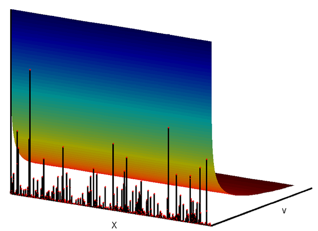

<!-- Limit image width and height -->
<style type='text/css'>
img {
    max-height: 500px;
    max-width: 700px;
}
</style>

<!-- Center image on slide -->
<script src="http://ajax.aspnetcdn.com/ajax/jQuery/jquery-1.7.min.js"></script>
<script type='text/javascript'>
$(function() {
    $("p:has(img)").addClass('centered');
});
</script>

# Motivation

- Recent work: priors on sparse / scale-free graphs
- Can this be extended to modeling communities?


--- .class #id 
# Outline

Review 
-----
- Networks as random measures
- Scale-free inducing construction

Modeling communities
------
- Preliminary ideas
- Unresolved issues

Supplemental materials
-------
- *R* package on [bitbucket](https://bitbucket.org/krisrs1128/bnpgraph)
- A report is on [my website](http://www.stanford.edu/~kriss1/projects), includes
some references

---
# Motivation
* Impossible to model sparse exchangeable graphs via exchangeable adjacency matrices.

# Recent development
* View a network as an exchangeable point process.
* A point process $Z = \sum_{i, j} z_{ij} \delta_{\theta_{i}, \theta_{j}}$ on $\mathbb{R}^{2}_{+}$ is called 
jointly exchangeable if 
$$Z \left(A_{i} \times A_{j} \right) \overset{\mathcal{L}}{=} Z \left(A_{\pi \left( i\right)} \times A_{\pi \left(j\right)}\right) \label{eq:measure_exchangeability}. $$
* Possible to sample, and can lead to sparse graphs.

---
# Model of Fox and Caron

$$
  W \sim CRM \left(\rho, \lambda\right) \\
  D = \text{PoissonProcess}\left(W \times W \right) = \sum_{i, j} n_{ij} \delta_{\theta_{i}, \theta_{j}}\\
  Z = \text{Capped}\left(\text{Symmetrized}\left(D\right) \right) = 
  \sum_{i, j} \left[\left(n_{ij} + n_{ji}\right) \wedge 1 \right] \delta_{\theta_{i}, \theta_{j}}
$$
where $\rho$ is a Levy intensity and $\lambda$ is the Lebesgue measure on $\mathbb{R}_{+}$.
In practice, we have to restrict to $\lambda_{\alpha}$. 

<div style='text-align: center;'>
    
</div>
Figure from Favaro and Teh "MCMC for Normalized Random Measure 
Mixture Models".

---

```{r setup, results='asis', echo = F}
library(knitr)
knit_hooks$set(webgl = hook_webgl)
cat('<script type="text/javascript">', readLines(system.file('WebGL', 'CanvasMatrix.js', package = 'rgl')), '</script>', sep = '\n')
opts_chunk$set(warnings = F, fig.align = "center")
```

```{r load_libs, echo = F}
library("BNPgraph")
library("rgl")
library("plyr")
library("ggplot2")
library("reshape2")
```

```{r d_plot, webgl = TRUE}
a <- 1; tau <- 1; sigma <- 0.4
alpha <- 20
D <- NGGPGraph(a, tau, sigma, alpha); colnames(D) <- c("theta1", "theta2")
D.counts <- ddply(data.frame(D), .(theta1, theta2), summarise, counts = nrow(piece))
plot3d(D.counts, type = "h")
```

---
```{r igraph_uncap}
library("igraph")
D.graph <- graph.edgelist(as.matrix(colwise(as.character)(round(data.frame(D), 3))))
plot.igraph(D.graph, edge.curved = TRUE, edge.arrow.mode = 1)
```

---
```{r graph_capped, webgl = TRUE}
Z <- UndirectedGraph(D) # symmetrizes and caps graph
colnames(Z) <- c("theta1", "theta2")
Z.counts <- ddply(data.frame(Z), .(theta1, theta2), summarise, counts = nrow(piece))
plot3d(Z.counts, type = "h")
```

---

```{r igraph_cap}
Z.graph <- graph.edgelist(as.matrix(colwise(as.character)(round(data.frame(Z), 3))))
plot.igraph(Z.graph, edge.curved = TRUE, edge.arrow.mode = 1)
```

---

# Properties

* $Z$ is jointly exchangeable.
* It is possible to sample this model exactly, for appropriate
  choices of $W$.
* When $W$ is chosen to be an NGGP, the proportion of nodes in $D_{\alpha}$ with $j$ total outgoing or ingoing edges -- with self-loops counting twice -- tends to
$$
  \frac{N_{\alpha, j}}{N_{\alpha}} \xrightarrow{\alpha \to \infty} p_{\sigma_{j}} = 
  \frac{\sigma \Gamma \left(j - \sigma\right)}{\Gamma \left(1 - \sigma \right) \Gamma \left(j + 1\right)},
$$
This implies $D$ has an approximately power-law degree distribution
for large $j$, and (after some work) that the network $Z$ 
is sparse in the limit.

---
```{r subquadratic, fig.align = "center", fig.height = 4}
g.alpha <- read.csv("g_across_alpha.csv")
ggplot(g.alpha,
	aes(x = log(n.node, 10), y = log(n.edge, 10), group = sigma)) +
    geom_point(aes(shape = as.factor(sigma), col = alpha)) +
    geom_abline(aes(slope = 2 - sigma), alpha = 0.5) + 
    geom_abline(aes(slope = 2), col = "red") + 
    ggtitle("Subquadratic growth in number of edges")
```

---
# Proposal: Modeling communities

Draw $W = \sum_{i} w_{i} \delta_{\theta_{i}} \sim \text{CRM} \left(\rho, \lambda\right)$. 
For every $\theta_{i} \in \text{supp}\left(W\right)$, draw 

$$
  p_{\theta_{i}} \overset{iid}{\sim} GEM \left(\beta\right),
$$

a stick-breaking process with parameter $\beta$. 

```{r stick_break, fig.height = 3.5}
p <- SampleSB(4, 5, 15)
ggplot(melt(p), aes(x = Var2, y = value, color = as.factor(Var1))) + geom_line()
```

---
Draw $(a_{ij})_{(i,j) \in \mathbb{N}^{2}} \overset{iid}{\sim}$
Beta$(\gamma, \delta)$, representing associations between communities.
For example, an interesting case would be if $A$ is block diagonal.
 Define a "node affinity function,"

$$
H_{A}\left(p_{\theta_{i}}, p_{\theta_{j}}\right) = p_{\theta_{i}}^{T} A p_{\theta_{j}}.
$$

Define networks by
$$
\newcommand{\W}{\tilde{W}}
\newcommand{\D}{\tilde{D}}
\newcommand{\Z}{\tilde{Z}}
  \W = \sum_{i, j}  H_{A}\left(p_{\theta_{i}}, p_{\theta_{j}}\right) w_{i}w_{j} \delta_{\theta_{i}, \theta_{j}} \\
  \D \sim \text{PoissonProcess}\left(\W\right) \\
  \Z = \text{Capped}\left(\text{Symmetrized}\left(\D\right)\right).
$$

This scheme is implemented in the *MMGraph()* function.

Alternatively, we could consider a "hard clustering" for each $\theta_{i}$. 

---

# Properties
* $\D$ is jointly exchangeable.
* $\D$ is a thinning of $D$.
* Can be sampled approximately.
* Still sparse asymptotically.

---
There are a few obvious omissions... 
* A number of interesting quantities about the behavior of the sampler with communities
   are well characterized, either theoretically or experimentally.
* There is no application to data, or even a discussion of how to sample from the posterior 
  for any of these models.
* A clear interpretation or characterization of joint exchangeability of networks / 
  measures has not been described.

---